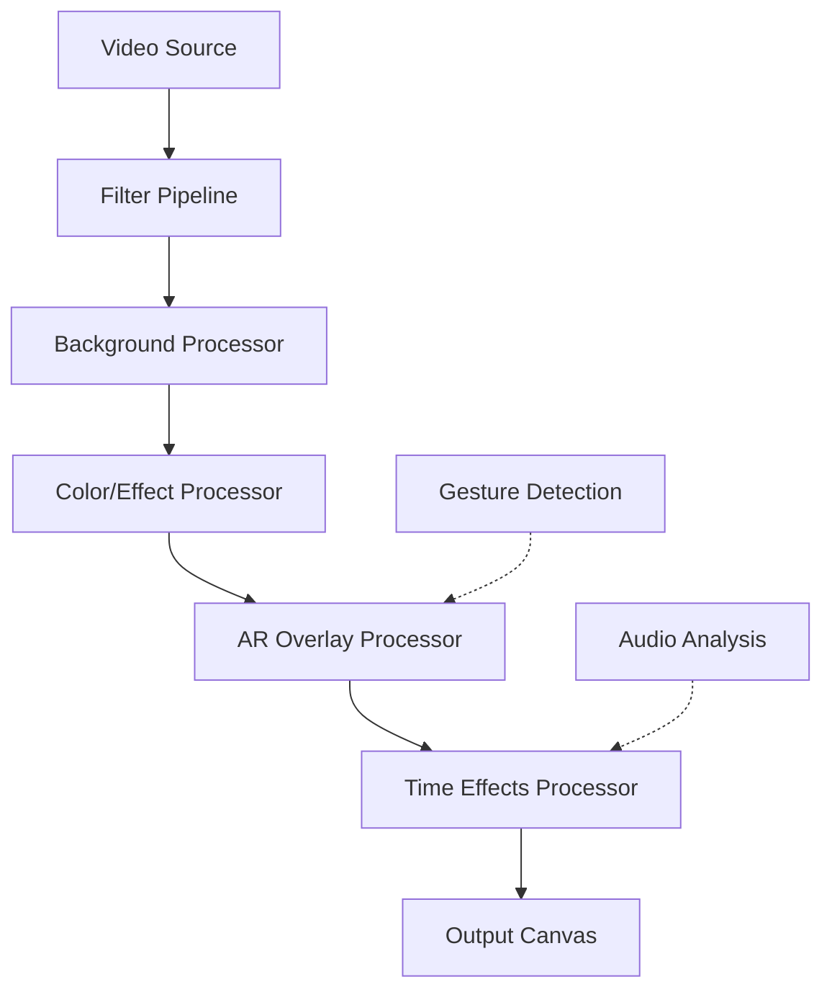

# TikTok-Style Filter Engine Architecture Plan

## Overview

Transform the existing basic FilterEngine into a comprehensive TikTok-style filter system supporting:
1. **Color/Effect Filters** - TikTok presets + beauty smoothing
2. **AR Face Filters** - Face tracking animated overlays
3. **Background Effects** - Virtual backgrounds + blur
4. **Green Screen/Chroma Key** - Background replacement
5. **Interactive/Gesture Filters** - Gesture-responsive effects
6. **Time-based Effects** - Slow-mo, rewind, motion blur

## Current State

- ✅ Basic MediaPipe FaceMesh integration
- ✅ Simple canvas-drawn overlays (Cat ears, glasses, bunny/fox mask)
- ✅ Basic CSS filters (Warmth, Noir, Neon)
- ❌ Limited filter variety
- ❌ No background segmentation
- ❌ No gesture detection
- ❌ No time effects

---

## Architecture Design

### 1. Core Filter Pipeline



### 2. Filter Engine Class Structure

```typescript
// src/engines/media/FilterEngine.ts - Expanded

interface FilterConfig {
    id: string;
    name: string;
    category: FilterCategory;
    icon: string;
    intensity: number; // 0-100
    options?: Record<string, any>;
}

enum FilterCategory {
    BEAUTY = "beauty",
    COLOR = "color", 
    AR_FACE = "ar_face",
    BACKGROUND = "background",
    GREEN_SCREEN = "green_screen",
    GESTURE = "gesture",
    TIME = "time"
}

class FilterEngine {
    // MediaPipe instances
    private faceMesh: FaceMesh | null;
    private selfieSegmentation: SelfieSegmentation | null;
    private hands: Hands | null;
    
    // Processing
    private backgroundCanvas: OffscreenCanvas;
    private processingCanvas: OffscreenCanvas;
    private outputCanvas: OffscreenCanvas;
    
    // State
    private activeFilters: Map<string, FilterConfig> = new Map();
    private gestureState: GestureState = {};
    
    // Methods
    async initialize(): Promise<void>;
    async applyFilter(config: FilterConfig): Promise<void>;
    processFrame(videoFrame: VideoFrame): CanvasRenderingContext2D;
}
```

---

## Phase 1: Color/Effect Filters (TikTok Presets + Beauty)

### Implementation

**1.1 TikTok-Style Color Presets**

| Preset Name | CSS/SVG Filter | Description |
|-------------|----------------|-------------|
| Classic | `sepia(0.15) contrast(1.1) saturate(1.2)` | Original TikTok look |
| Warm | `sepia(0.3) saturate(1.4) brightness(1.05)` | Golden hour warmth |
| Cool | `hue-rotate(190deg) saturate(0.9) brightness(1.05)` | Cool blue tones |
| Vintage | `sepia(0.4) contrast(1.1) saturate(0.8)` | Retro film look |
| Cinematic | `contrast(1.2) saturate(1.1) brightness(0.95)` | Movie-grade color |
| Dramatic | `contrast(1.4) saturate(1.3) brightness(0.9)` | High contrast |
| Dreamy | `brightness(1.15) saturate(1.1) blur(0.5px)` | Soft ethereal look |
| Noir | `grayscale(1) contrast(1.2)` | Black & white |

**1.2 Beauty/Smoothing Filters**

| Filter | Implementation |
|--------|----------------|
| Soft Glam | `brightness(1.05) contrast(1.02) saturate(0.95)` + bilateral filter |
| Radiance | `brightness(1.1) saturate(1.15)` + skin glow shader |
| Porcelain | `brightness(1.12) contrast(0.9) saturate(0.85)` |
| Acne Remove | ML-based skin smoothing (TensorFlow.js) |
| Face Slim | Geometric warp based on face landmarks |

**1.3 Technical Implementation**

```typescript
// src/engines/media/processors/ColorFilterProcessor.ts
export class ColorFilterProcessor {
    private ctx: CanvasRenderingContext2D;
    
    applyColorPreset(ctx: CanvasRenderingContext2D, preset: ColorPreset): void {
        // Use WebGL for real-time performance
        const shader = this.getShaderForPreset(preset);
        this.applyGLShader(shader);
    }
    
    applyBeautyFilter(ctx: CanvasRenderingContext2D, intensity: number): void {
        // Bilateral filter for skin smoothing
        this.applyBilateralFilter(ctx, intensity);
    }
}
```

---

## Phase 2: AR Face Filters

### MediaPipe Models Required

1. **FaceMesh** - 468 facial landmarks (already integrated)
2. **Face Detection** - Faster face bounding box
3. **Iris** - Eye tracking for gaze effects

### AR Filter Types

**2.1 Static Overlays**
- Cat Ears ✅ (existing, improve quality)
- Dog Ears
- Crown/Tiara
- Headband/Horns
- Face Paint/Butterfly
- Glasses (aviator, heart-shaped, pixel)

**2.2 Animated Effects**
- Fire streaming down
- Rain/Snow particles
- Sparkles/Stars
- Hearts floating up
- Rainbow/gradient flows
- 3D avatar face swap

**2.3 Expression-Based**
- Blink to trigger effects
- Smile to activate
- Open mouth for surprise effect
- Raise eyebrows

### Implementation

```typescript
// src/engines/media/processors/ARFilterProcessor.ts
export class ARFilterProcessor {
    private assets: Map<string, HTMLImageElement | SpriteSheet> = new Map();
    private animations: Map<string, AnimationController> = new Map();
    
    async loadARAsset(assetId: string): Promise<void> {
        // Load PNG/Sprite sheets or 3D models
        const asset = await this.loadFromCDN(`/assets/ar/${assetId}`);
        this.assets.set(assetId, asset);
    }
    
    renderAROverlay(
        ctx: CanvasRenderingContext2D, 
        landmarks: NormalizedLandmark[],
        filter: ARFilter
    ): void {
        const position = this.getFaceAnchor(filter.anchor, landmarks);
        const animationFrame = this.animations.get(filter.id)?.getCurrentFrame();
        this.drawAsset(ctx, filter.asset, position, animationFrame);
    }
}
```

---

## Phase 3: Background Effects

### MediaPipe Selfie Segmentation

```typescript
// Use SelfieSegmentation for background separation
import { SelfieSegmentation } from '@mediapipe/selfie_segmentation';

private async initializeSegmentation(): Promise<void> {
    this.selfieSegmentation = new SelfieSegmentation({
        modelSelection: 1, // 0=general, 1=landscape
    });
    this.selfieSegmentation.onResults(this.onSegmentationResults.bind(this));
}
```

### Background Effects

| Effect | Description | Implementation |
|--------|-------------|----------------|
| Blur | Background blur (bokeh) | Gaussian blur mask |
| Solid Color | Replace with color | Fill non-mask area |
| Image | Replace with image | Composite image |
| Video Loop | Replace with video | Video element compositing |
| AR Environment | 3D scene background | Three.js integration |

### Implementation

```typescript
// src/engines/media/processors/BackgroundProcessor.ts
export class BackgroundProcessor {
    private segmentationMask: ImageBitmap | null = null;
    private backgroundSource: HTMLImageElement | HTMLVideoElement | null = null;
    
    async setBackground(type: BackgroundType, source?: string): Promise<void> {
        switch(type) {
            case 'blur':
                this.blurAmount = 20;
                break;
            case 'image':
                this.backgroundSource = await this.loadImage(source);
                break;
            case 'video':
                this.backgroundSource = await this.loadVideo(source);
                break;
        }
    }
    
    process(ctx: CanvasRenderingContext2D, video: HTMLVideoElement): void {
        // 1. Draw original video
        // 2. Apply segmentation mask
        // 3. Composite background
    }
}
```

---

## Phase 4: Green Screen/Chroma Key

### Implementation

```typescript
// src/engines/media/processors/ChromaKeyProcessor.ts
export class ChromaKeyProcessor {
    // Configurable parameters
    private hueCenter: number = 120; // Green = 120
    private hueRange: number = 30;
    private saturationThreshold: number = 0.2;
    private lightnessThreshold: number = 0.1;
    
    setKeyColor(color: 'green' | 'blue' | 'custom', customHue?: number): void {
        if (color === 'green') this.hueCenter = 120;
        else if (color === 'blue') this.hueCenter = 240;
        else this.hueCenter = customHue;
    }
    
    process(ctx: CanvasRenderingContext2D): void {
        // HSL-based chroma key algorithm
        // Smooth edge detection with alpha blending
    }
}
```

---

## Phase 5: Interactive/Gesture Filters

### MediaPipe Hands

```typescript
import { Hands, HAND_CONNECTIONS } from '@mediapipe/hands';

private async initializeHands(): Promise<void> {
    this.hands = new Hands({
        maxNumHands: 2,
        modelComplexity: 1,
        minDetectionConfidence: 0.7,
    });
    this.hands.onResults(this.onHandsResults.bind(this));
}
```

### Gesture-Based Effects

| Gesture | Filter Response |
|---------|-----------------|
| 👋 Wave hand | Trigger sparkles/rainbow trail |
| 👍 Thumbs up | Hearts floating up |
| ✌️ Peace sign | Split screen effect |
| 🖐️ Open palm | Slow motion toggle |
| 👊 Fist | Fire effect intensity up |
| 👍+👎 Together | Filter transition |
| Blink | Eye color change |
| Smile | Apply beauty filter |

---

## Phase 6: Time-based Effects

### Implementation Options

1. **Web Audio API** - For audio-synced visual effects
2. **MediaRecorder** - For rewind/slow-mo capture buffer
3. **CSS/JS Animation** - For visual time effects

### Time Effects

| Effect | Description | Implementation |
|--------|-------------|----------------|
| Slow Motion | 0.25x, 0.5x speed | Frame blending/interpolation |
| Fast Forward | 2x, 4x speed | Frame skipping |
| Rewind | Reverse playback | Frame buffer reversal |
| Freeze | Pause frame | Static frame hold |
| Motion Blur | Trail effect | Frame accumulation |
| Echo | Delayed frames | Ghosting effect |

---

## UI/UX Improvements

### FiltersTray Enhancement

```typescript
// New Filter Panel Layout
interface FilterPanelState {
    activeCategory: FilterCategory;
    selectedFilter: FilterConfig | null;
    intensity: number; // 0-100 slider
    filterOptions: Record<string, any>; // Per-filter settings
}

// Filter Categories Tabs
const FILTER_TABS = [
    { id: 'beauty', icon: 'face_retouching_natural', label: 'Beauty' },
    { id: 'color', icon: 'palette', label: 'Filters' },
    { id: 'ar_face', icon: 'face', label: 'AR' },
    { id: 'background', icon: 'wallpaper', label: 'Background' },
    { id: 'green_screen', icon: 'green_screen', label: 'Chroma' },
    { id: 'gesture', icon: 'pan_tool', label: 'Gesture' },
    { id: 'time', icon: 'slow_motion_video', label: 'Time' },
];
```

### Filter Preview Thumbnails

- Generate preview thumbnails for each filter
- Show intensity slider when filter selected
- Display filter name and category
- Quick toggle on/off

---

## Technical Dependencies

### NPM Packages Required

```json
{
  "@mediapipe/face_mesh": "^0.4",
  "@mediapipe/selfie_segmentation": "^0.4",
  "@mediapipe/hands": "^0.4",
  "@mediapipe/face_detection": "^0.4",
  "@mediapipe/iris": "^0.4",
  "@mediapipe/util": "^0.3"
}
```

### Optional (for advanced effects)

```json
{
  "@tensorflow/tfjs": "^4.0",
  "@tensorflow-models/face-landmarks-detection": "^1.0",
  "three": "^0.160" // For 3D AR backgrounds
}
```

---

## Implementation Priority

### MVP (Minimum Viable Product)
1. ✅ Expand color presets (add Classic, Cinematic, Dramatic, Dreamy)
2. ✅ Add beauty smoothing presets
3. ✅ Improve existing AR face filters (better positioning, animations)
4. ✅ Add more AR filters (crown, glasses variants)
5. ✅ Background blur (using selfie segmentation)

### Phase 2 (Enhanced Features)
1. Background image/video replacement
2. Green screen/chroma key
3. Gesture detection integration

### Phase 3 (Advanced)
1. Time-based effects
2. 3D avatar face swap
3. AR environment backgrounds

---

## File Structure Changes

```
src/engines/media/
├── FilterEngine.ts          # Main orchestrator (refactor)
├── processors/
│   ├── ColorFilterProcessor.ts
│   ├── ARFilterProcessor.ts
│   ├── BackgroundProcessor.ts
│   ├── ChromaKeyProcessor.ts
│   ├── GestureProcessor.ts
│   └── TimeEffectProcessor.ts
├── assets/
│   ├── ar/                  # AR filter assets (PNG sprites)
│   ├── backgrounds/         # Background images/videos
│   └── shaders/             # GLSL filter shaders
└── config/
    └── filterPresets.ts     # All filter configurations
```

---

## Performance Considerations

1. **WebGL Rendering** - Use WebGL instead of Canvas 2D for real-time performance
2. **Offscreen Canvas** - Process in worker thread
3. **Model Optimization** - Use lite models where possible
4. **Frame Skipping** - Process every N frames for heavy effects
5. **Asset Caching** - Preload AR assets on initialization
6. **GPU Acceleration** - Enable hardware acceleration

---

## Testing Plan

1. Test all filters on different face angles/lighting
2. Test background segmentation on various backgrounds
3. Test gesture recognition accuracy
4. Test performance on mid-range devices
5. Test chroma key with different green screen setups

---

*Plan created for Live Studio Pro Filter Engine enhancement*
