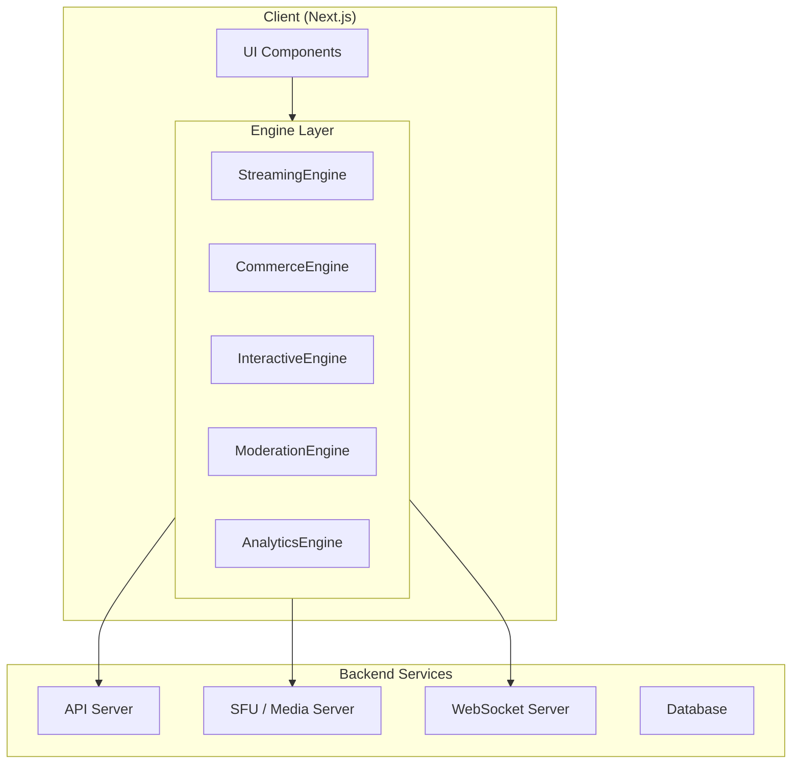
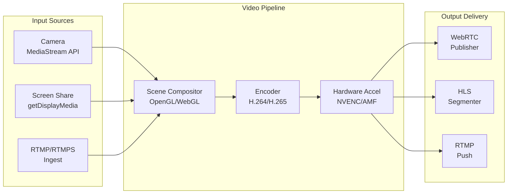
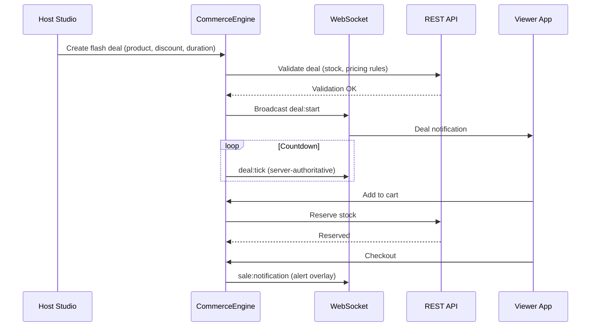
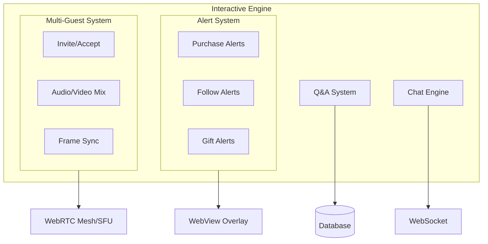
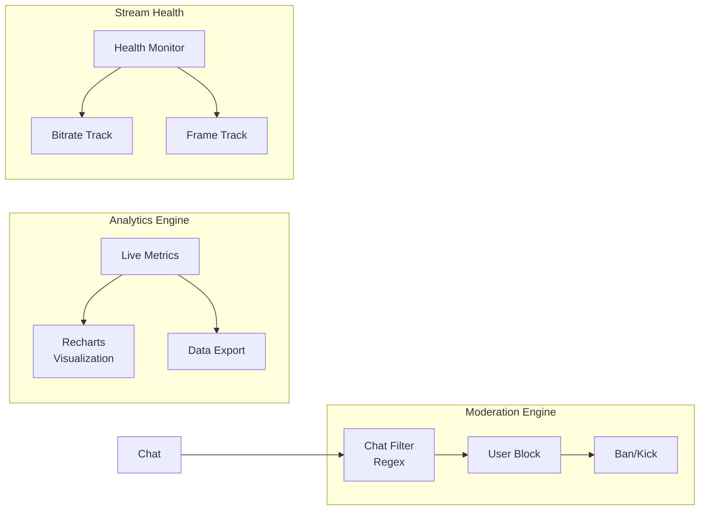

# Live Studio Pro - Engine Architecture Transformation Plan

## Executive Summary

This document outlines a comprehensive plan to transform the current Live Studio Pro project from dummy UI implementations into proper engine architectures. The project currently has basic scene management, filter effects using MediaPipe, and simple Socket.IO-based state management. We need to build professional-grade engines for:

1. **Core Streaming Engine** - Video pipeline with RTMP/RTMPS/WebRTC support
2. **Commerce Module** - Product pinning, live discounts, checkout overlays
3. **Real-Time Interactive Features** - Alerts, co-hosting, Q&A
4. **Moderation & Analytics** - Dashboard, filtering, health monitoring

---

## Current State Analysis

### Existing Engine Files

| File | Current Implementation | Status |
|------|----------------------|--------|
| [`SceneEngine.ts`](/src/engines/SceneEngine.ts) | Static scene presets (layout + overlay config) | Basic |
| [`FilterEngine.ts`](/src/engines/media/FilterEngine.ts) | MediaPipe face mesh with AR overlays | Working |
| [`StudioServer.ts`](/src/engines/studio/StudioServer.ts) | Socket.IO event handlers | Basic |
| [`StudioStore.ts`](/src/engines/studio/StudioStore.ts) | In-memory state with broadcasting | Basic |
| [`types.ts`](/src/engines/studio/types.ts) | ChatMessage, FlashDeal interfaces | Basic |

### Current UI Components (Need Engine Integration)

| Component | Current Approach | Required Engine |
|-----------|-----------------|-----------------|
| [`VideoPane.tsx`](/src/app/live/components/VideoPane.tsx) | Static placeholder | StreamingEngine |
| [`CommerceDrawers.tsx`](/src/app/live/components/CommerceDrawers.tsx) | Local state | CommerceEngine |
| [`InteractionPanel.tsx`](/src/app/live/components/InteractionPanel.tsx) | Local state + props | InteractiveEngine |
| [`StagePanel.tsx`](/src/app/studio/components/StagePanel.tsx) | Props passing | StreamingEngine |
| [`CommercePanel.tsx`](/src/app/studio/components/CommercePanel.tsx) | Props passing | AnalyticsEngine |

---

## Architecture Overview



---

## Phase 1: Core Streaming Engine (Video Pipeline)

### 1.1 Architecture Design



### 1.2 Engine Modules to Create

| Module | File | Responsibilities |
|--------|------|------------------|
| StreamingEngine | `src/engines/streaming/StreamingEngine.ts` | Main orchestration |
| SceneManager | `src/engines/streaming/SceneManager.ts` | Scene/source composition |
| VideoEncoder | `src/engines/streaming/VideoEncoder.ts` | H.264/H.265 encoding |
| HardwareAccel | `src/engines/streaming/HardwareAccel.ts` | NVENC/AMF integration |
| StreamOutput | `src/engines/streaming/StreamOutput.ts` | RTMP/WebRTC/HLS output |
| StreamHealth | `src/engines/streaming/StreamHealth.ts` | Bitrate/frame monitoring |

### 1.3 Key Interfaces

```typescript
// src/engines/streaming/types.ts
export interface StreamConfig {
  protocol: 'rtmp' | 'rtmps' | 'webrtc';
  resolution: { width: number; height: number };
  framerate: number;
  bitrate: number;
  codec: 'h264' | 'h265';
  hardwareAccel: 'nvenc' | 'amf' | 'software';
}

export interface Source {
  id: string;
  type: 'camera' | 'screen' | 'image' | 'video' | 'rtmp';
  stream?: MediaStream;
  transform?: Transform;
}

export interface Scene {
  id: string;
  name: string;
  sources: Source[];
  layout: 'full' | 'split' | 'pip' | 'grid';
  audioSources: string[];
}

export interface StreamHealth {
  bitrate: number;
  fps: number;
  droppedFrames: number;
  latency: number;
  health: 'good' | 'degraded' | 'critical';
}
```

### 1.4 Integration with Existing Code

- Replace [`StagePanel.tsx`](/src/app/studio/components/StagePanel.tsx) scene selection with `SceneManager`
- Replace video placeholder in [`VideoPane.tsx`](/src/app/live/components/VideoPane.tsx) with `StreamingEngine` output
- Extend existing [`SceneEngine.ts`](/src/engines/SceneEngine.ts) with composition capabilities

---

## Phase 2: Commerce Module

### 2.1 Architecture Design



### 2.2 Engine Modules to Create

| Module | File | Responsibilities |
|--------|------|------------------|
| CommerceEngine | `src/engines/commerce/CommerceEngine.ts` | Main orchestration |
| ProductPinning | `src/engines/commerce/ProductPinning.ts` | Pinned product state sync |
| FlashDealManager | `src/engines/commerce/FlashDealManager.ts` | Server-authoritative timers |
| CartManager | `src/engines/commerce/CartManager.ts` | Cart operations |
| CheckoutService | `src/engines/commerce/CheckoutService.ts` | Checkout flow |

### 2.3 Key Interfaces

```typescript
// src/engines/commerce/types.ts
export interface ProductPinningState {
  productId: string | null;
  pinnedAt: number | null;
  pinnedBy: string;
  wholesaleTier: WholesaleTier | null;
  locked: boolean;
}

export interface FlashDeal {
  id: string;
  productId: string;
  discountPct: number;
  startTime: number;      // Server timestamp
  endTime: number;        // Server timestamp
  originalPrice: number;
  dealPrice: number;
  stockLimit: number;
  soldCount: number;
}

export interface CartItem {
  productId: string;
  quantity: number;
  packType: 'Unit' | 'Pack' | 'Carton' | 'Pallet';
  unitPrice: number;
  total: number;
}

export interface CheckoutSession {
  id: string;
  items: CartItem[];
  total: number;
  currency: string;
  status: 'pending' | 'processing' | 'completed' | 'failed';
}
```

### 2.4 Integration with Existing Code

- Replace commerce state in [`CommerceDrawers.tsx`](/src/app/live/components/CommerceDrawers.tsx) with `CommerceEngine`
- Extend [`StudioStore.ts`](/src/engines/studio/StudioStore.ts) flash deal with server-authoritative timing
- Replace hardcoded prices in [`VideoPane.tsx`](/src/app/live/components/VideoPane.tsx) with real-time sync

---

## Phase 3: Real-Time Interactive Features

### 3.1 Architecture Design



### 3.2 Engine Modules to Create

| Module | File | Responsibilities |
|--------|------|------------------|
| InteractiveEngine | `src/engines/interactive/InteractiveEngine.ts` | Main orchestration |
| AlertManager | `src/engines/interactive/AlertManager.ts` | Purchase/follow/gift alerts |
| CohostManager | `src/engines/interactive/CohostManager.ts` | Multi-guest coordination |
| QASystem | `src/engines/interactive/QASystem.ts` | Q&A highlight system |
| ChatEngine | `src/engines/interactive/ChatEngine.ts` | Real-time chat |

### 3.3 Key Interfaces

```typescript
// src/engines/interactive/types.ts
export interface Alert {
  id: string;
  type: 'purchase' | 'follow' | 'gift' | 'subscription';
  viewer: { id: string; name: string; avatar?: string };
  data: PurchaseAlertData | GiftAlertData | FollowAlertData;
  timestamp: number;
  displayDuration: number;
}

export interface CohostSession {
  id: string;
  hosts: Cohost[];
  state: 'invited' | 'connecting' | 'active' | 'ended';
  startedAt: number;
  audioEnabled: boolean;
  videoEnabled: boolean;
}

export interface QAItem {
  id: string;
  question: string;
  author: { id: string; name: string };
  status: 'pending' | 'pinned' | 'answered';
  highlights: number;  // Times highlighted by host
  createdAt: number;
  answeredAt?: number;
  answer?: string;
}

export interface ChatMessage {
  id: string;
  author: Viewer;
  content: string;
  timestamp: number;
  filtered: boolean;
  moderationReason?: string;
}
```

### 3.4 Integration with Existing Code

- Replace chat in [`InteractionPanel.tsx`](/src/app/live/components/InteractionPanel.tsx) with `ChatEngine`
- Add alert overlays to [`VideoPane.tsx`](/src/app/live/components/VideoPane.tsx) via `AlertManager`
- Extend Q&A in [`AudiencePanel.tsx`](/src/app/studio/components/AudiencePanel.tsx) with `QASystem`

---

## Phase 4: Moderation & Analytics

### 4.1 Architecture Design



### 4.2 Engine Modules to Create

| Module | File | Responsibilities |
|--------|------|------------------|
| ModerationEngine | `src/engines/moderation/ModerationEngine.ts` | Main orchestration |
| ChatFilter | `src/engines/moderation/ChatFilter.ts` | Regex-based filtering |
| UserModeration | `src/engines/moderation/UserModeration.ts` | Block/ban/kick |
| AnalyticsEngine | `src/engines/analytics/AnalyticsEngine.ts` | Metrics aggregation |
| StreamHealthMonitor | `src/engines/analytics/StreamHealthMonitor.ts` | Health tracking |

### 4.3 Key Interfaces

```typescript
// src/engines/moderation/types.ts
export interface ModerationRule {
  id: string;
  type: 'regex' | 'keyword' | 'domain' | 'user';
  pattern: string;
  action: 'block' | 'warn' | 'flag' | 'replace';
  severity: 'low' | 'medium' | 'high';
  enabled: boolean;
}

export interface ModerationAction {
  id: string;
  userId: string;
  type: 'warn' | 'mute' | 'kick' | 'ban';
  reason: string;
  moderatorId: string;
  timestamp: number;
  expiresAt?: number;
}

export interface StreamMetrics {
  sessionId: string;
  timestamp: number;
  viewers: {
    total: number;
    peak: number;
    concurrent: number;
  };
  engagement: {
    messages: number;
    reactions: number;
    questions: number;
  };
  commerce: {
    cartAdds: number;
    purchases: number;
    revenue: number;
    conversionRate: number;
  };
}

// src/engines/analytics/types.ts
export interface HealthMetric {
  timestamp: number;
  bitrate: number;
  fps: number;
  droppedFrames: number;
  latency: number;
  qualityScore: number;
}

export interface HealthAlert {
  id: string;
  type: 'bitrate' | 'fps' | 'latency' | 'dropped';
  severity: 'warning' | 'critical';
  message: string;
  timestamp: number;
}
```

### 4.4 Integration with Existing Code

- Add chat filtering to [`InteractionPanel.tsx`](/src/app/live/components/InteractionPanel.tsx) via `ChatFilter`
- Replace static stats in [`CommercePanel.tsx`](/src/app/studio/components/CommercePanel.tsx) with `AnalyticsEngine`
- Add health indicators to [`StagePanel.tsx`](/src/app/studio/components/StagePanel.tsx) via `StreamHealthMonitor`

---

## Implementation Priority

### Priority 1: Core Infrastructure
1. Create engine directory structure
2. Define TypeScript interfaces for all engines
3. Implement base classes

### Priority 2: Streaming Engine
1. SceneManager + source handling
2. VideoEncoder with WebCodecs API
3. StreamOutput (WebRTC publisher)

### Priority 3: Commerce Module
1. ProductPinning with WebSocket sync
2. FlashDealManager (server-authoritative)
3. Checkout integration

### Priority 4: Interactive Features
1. AlertManager for overlays
2. ChatEngine with filtering
3. CohostManager (SFU integration ready)

### Priority 5: Moderation & Analytics
1. ChatFilter regex engine
2. AnalyticsEngine aggregation
3. StreamHealthMonitor

---

## Technical Considerations

### WebRTC/RTMPS Protocol Selection

| Use Case | Protocol | Latency | Notes |
|----------|----------|---------|-------|
| Real-time interaction | WebRTC | <500ms | Lowest latency, browser native |
| RTMP ingest | RTMP/RTMPS | ~1-2s | Legacy encoder support |
| HLS fallback | HLS | 5-10s | Better CDN compatibility |
| Hybrid approach | WebRTC + HLS | Adaptive | Recommended for production |

### Hard Sync for Price/Video

```typescript
// Server-authoritative pricing prevents manipulation
interface PriceUpdate {
  productId: string;
  price: number;
  timestamp: number;  // Server time
  signature: string;   // Prevent client tampering
}

// Client validates against server time
function isValidPrice(priceUpdate: PriceUpdate): boolean {
  const serverTime = await fetchServerTime();
  const drift = Math.abs(serverTime - priceUpdate.timestamp);
  return drift < 5000;  // Max 5 second drift allowed
}
```

### Native UI + Web Overlays

```typescript
// Video layer: Native (best performance)
<video ref={videoRef} className="native-video" />

// Commerce/Chat: React components
<CommerceOverlay engine={commerceEngine} />

// Alerts: WebView for complex animations
<WebView 
  src="/overlays/alerts.html"
  alerts={alertEngine.getActiveAlerts()}
/>
```

---

## File Structure After Transformation

```
src/engines/
├── index.ts                    # Engine exports
├── types.ts                    # Shared types
├── streaming/
│   ├── index.ts
│   ├── types.ts               # StreamConfig, Source, Scene
│   ├── StreamingEngine.ts     # Main orchestrator
│   ├── SceneManager.ts        # Scene composition
│   ├── VideoEncoder.ts        # WebCodecs H.264/H.265
│   ├── HardwareAccel.ts       # NVENC/AMF detection
│   ├── StreamOutput.ts        # WebRTC/HLS/RTMP
│   └── StreamHealth.ts        # Monitoring
├── commerce/
│   ├── index.ts
│   ├── types.ts               # ProductPinning, FlashDeal, Cart
│   ├── CommerceEngine.ts      # Main orchestrator
│   ├── ProductPinning.ts      # State sync service
│   ├── FlashDealManager.ts    # Server-authoritative timers
│   ├── CartManager.ts         # Cart operations
│   └── CheckoutService.ts     # Checkout flow
├── interactive/
│   ├── index.ts
│   ├── types.ts               # Alert, Cohost, QA
│   ├── InteractiveEngine.ts  # Main orchestrator
│   ├── AlertManager.ts        # Purchase/follow/gift
│   ├── CohostManager.ts       # Multi-guest (SFU-ready)
│   ├── QASystem.ts            # Q&A highlight
│   └── ChatEngine.ts          # Real-time chat
├── moderation/
│   ├── index.ts
│   ├── types.ts               # ModerationRule, Action
│   ├── ModerationEngine.ts    # Main orchestrator
│   ├── ChatFilter.ts          # Regex filtering
│   └── UserModeration.ts      # Block/ban/kick
├── analytics/
│   ├── index.ts
│   ├── types.ts               # StreamMetrics, HealthMetric
│   ├── AnalyticsEngine.ts     # Metrics aggregation
│   ├── StreamHealthMonitor.ts # Health tracking
│   └── DataExporter.ts        # CSV/JSON export
└── media/
    ├── index.ts
    ├── FilterEngine.ts        # Existing - MediaPipe AR
    └── FilterTypes.ts         # Filter type definitions
```

---

## Next Steps

1. **Review and Approve**: User reviews this plan
2. **Phase 1 Start**: Begin Streaming Engine implementation
3. **Iterative Build**: Each engine built in priority order
4. **Integration**: Connect engines to existing UI components
5. **Testing**: Validate end-to-end flows

---

*Plan created: 2026-03-03*
*Project: Live Studio Pro*
*Version: 1.0*
