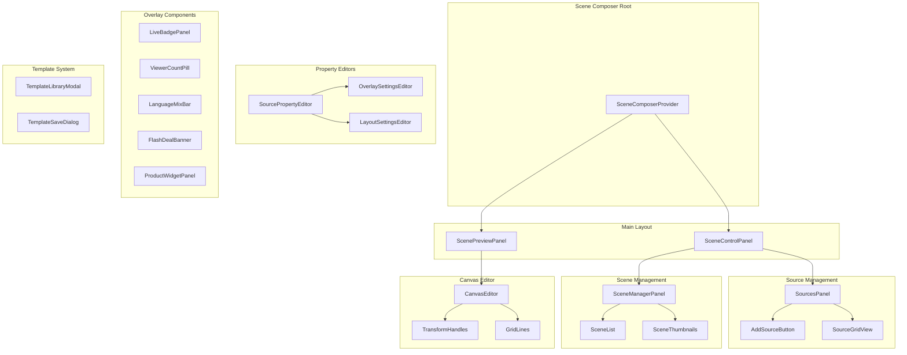
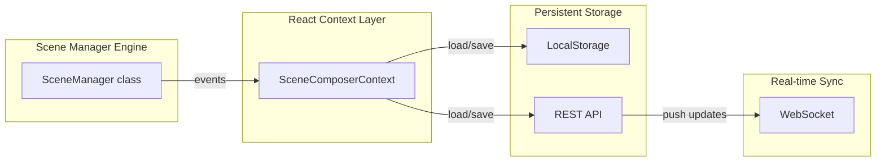
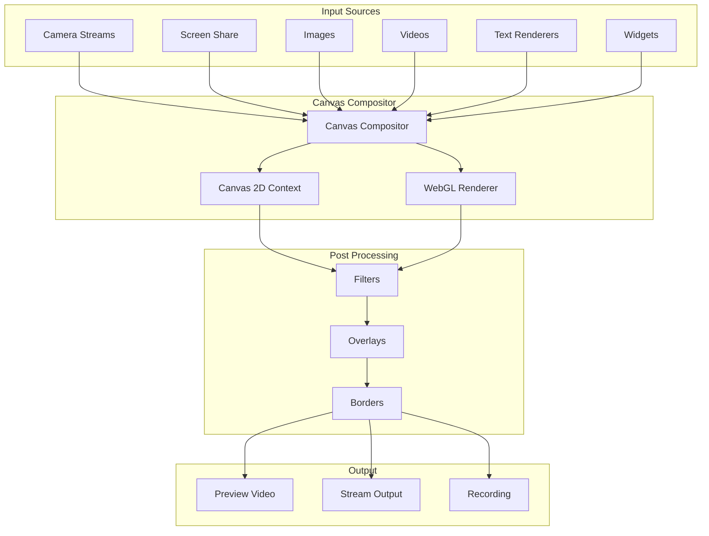

# Pre-Live Lobby Scene Composer Architecture Plan

## 1. Executive Summary

This document outlines the comprehensive architecture for transforming the current basic pre-live lobby in Live Studio Pro into a full-featured scene composer. The scene composer enables creators to arrange video sources, configure product widgets, set up overlays, manage multi-camera angles, and save/load scene templates before going live.

### 1.1 Design Principles

- **Intuitive for Creators**: Drag-and-drop interface with visual feedback
- **Professional Grade**: Support for complex layouts, transitions, and real-time preview
- **Seamless Integration**: Leverage existing StagePreview, SceneManager, and CommerceEngine
- **Performance First**: Canvas-based compositing with hardware acceleration

---

## 2. Data Models and Types

### 2.1 Core Type Definitions

```typescript
// ============================================
// Source Types
// ============================================

export type SourceType = 
  | 'camera'      // Webcam/capture device
  | 'screen'      // Screen/window share
  | 'image'       // Static image
  | 'video'       // Video file
  | 'text'        // Text overlay
  | 'browser'     // Webview/URL
  | 'product'     // Product showcase widget
  | 'price'       // Price tag display
  | 'cta'         // Call-to-action button
  | 'widget'       // Timer, stats, etc.
  | 'rtmp';       // External RTMP stream

export type SourceCategory = 
  | 'video'       // Cameras, screen share
  | 'media'       // Images, videos
  | 'overlay'     // Text, widgets
  | 'commerce';   // Product, price, CTA
```

### 2.2 Canvas Source

```typescript
export interface CanvasSource {
  // Identity
  id: string;
  name: string;
  type: SourceType;
  category: SourceCategory;
  
  // State
  enabled: boolean;
  visible: boolean;
  locked: boolean;
  muted: boolean;
  volume: number;        // 0-1
  
  // Layer ordering
  order: number;
  zIndex: number;
  
  // Transform (position & size)
  position: { x: number; y: number };
  size: { width: number; height: number };
  rotation: number;      // degrees
  scale: { x: number; y: number };
  
  // Effects
  opacity: number;       // 0-1
  crop?: CropRect;
  filter?: string;       // CSS filter string
  
  // Type-specific properties
  deviceId?: string;    // For camera
  url?: string;         // For browser/rtmp
  text?: string;        // For text
  imageUrl?: string;    // For image
  videoUrl?: string;    // For video
  
  // RTMP specific
  rtmpUrl?: string;
  rtmpKey?: string;
  
  // Commerce specific
  productId?: string;
  productConfig?: ProductWidgetConfig;
}

export interface CropRect {
  top: number;
  bottom: number;
  left: number;
  right: number;
}
```

### 2.3 Scene Definition

```typescript
export type SceneLayout = 
  | 'full'           // Single source full screen
  | 'split'          // Side-by-side (50/50)
  | 'pip'            // Picture-in-picture
  | 'grid'           // 2x2 or custom grid
  | 'triple'         // 3-source layout
  | 'custom';        // Free-form positioning

export type OverlayType = 
  | 'none'
  | 'lower_third'    // Name/title bar at bottom
  | 'hero'           // Featured product overlay
  | 'ticker'         // Scrolling text
  | 'offer_card'     // Flash deal card
  | 'badge';         // Live/viewer badges

export interface Scene {
  // Identity
  id: string;
  name: string;
  description?: string;
  
  // Layout configuration
  layout: SceneLayout;
  layoutConfig?: LayoutConfig;
  
  // Sources in scene (ordered by z-index)
  sources: SceneSourceRef[];
  
  // Overlay configuration
  overlays: OverlayConfig[];
  
  // Transitions
  transition?: SceneTransition;
  
  // Output settings
  outputResolution?: Resolution;
  
  // State
  isActive: boolean;
  isPreview: boolean;
  
  // Metadata
  thumbnailUrl?: string;
  createdAt: number;
  updatedAt: number;
}

export interface SceneSourceRef {
  sourceId: string;
  zIndex: number;
  locked: boolean;
  visible: boolean;
  transform?: Partial<SourceTransform>;
}

export interface SceneTransition {
  type: 'cut' | 'fade' | 'slide' | 'wipe' | 'blur';
  duration: number;     // milliseconds
  easing: 'linear' | 'ease' | 'ease-in' | 'ease-out';
}
```

### 2.4 Layout Configurations

```typescript
export interface LayoutConfig {
  // Predefined layouts define default positions
  // Custom layouts allow free positioning
  
  // Split layout
  splitConfig?: {
    position: 'left' | 'right' | 'top' | 'bottom';
    ratio: number;      // 0-1, e.g., 0.5 for 50/50
  };
  
  // PiP layout
  pipConfig?: {
    mainSourceIndex: number;
    pipPosition: 'top-left' | 'top-right' | 'bottom-left' | 'bottom-right';
    pipSize: number;   // 0-1, percentage of canvas
  };
  
  // Grid layout
  gridConfig?: {
    rows: number;
    cols: number;
    gap: number;       // pixels
    fillMode: 'cover' | 'contain' | 'stretch';
  };
  
  // Custom layout
  customConfig?: {
    regions: LayoutRegion[];
  };
}

export interface LayoutRegion {
  id: string;
  name: string;
  bounds: { x: number; y: number; width: number; height: number };
  sourceId?: string;
  zIndex: number;
}
```

### 2.5 Product Widget Configuration

```typescript
export interface ProductWidgetConfig {
  // Display settings
  displayMode: 'card' | 'banner' | 'badge' | 'carousel';
  position: WidgetPosition;
  size: { width: number; height: number };
  
  // Content
  showImage: boolean;
  showName: boolean;
  showPrice: boolean;
  showDiscount: boolean;
  showStock: boolean;
  showAddToCart: boolean;
  showBuyNow: boolean;
  
  // Styling
  theme: 'dark' | 'light' | 'auto';
  borderRadius: number;
  backgroundColor?: string;
  
  // Animation
  animation?: 'none' | 'slide' | 'fade' | 'pulse';
  
  // Product selection
  productId?: string;
  autoRotate?: boolean;
  rotationInterval?: number;  // seconds
}

export interface WidgetPosition {
  anchor: 'top-left' | 'top-right' | 'bottom-left' | 'bottom-right' | 'center';
  offset: { x: number; y: number };
}
```

### 2.6 Overlay Configuration

```typescript
export interface OverlayConfig {
  id: string;
  type: OverlayType;
  enabled: boolean;
  position: OverlayPosition;
  content: OverlayContent;
  style: OverlayStyle;
}

export type OverlayPosition = 
  | 'top-left' | 'top-center' | 'top-right'
  | 'bottom-left' | 'bottom-center' | 'bottom-right';

export interface OverlayContent {
  // Badge content
  liveBadge?: {
    show: boolean;
    showTimer: boolean;
    showViewerCount: boolean;
    showLanguageMix: boolean;
  };
  
  // Product overlay
  productOverlay?: {
    productId: string;
    template: 'hero' | 'card' | 'minimal';
  };
  
  // Text overlay
  textOverlay?: {
    text: string;
    fontSize: number;
    fontColor: string;
  };
  
  // Flash deal
  flashDeal?: {
    show: boolean;
    position: OverlayPosition;
    showCountdown: boolean;
    showDiscount: boolean;
  };
}

export interface OverlayStyle {
  backgroundColor: string;
  borderColor: string;
  borderRadius: number;
  padding: number;
  fontSize: number;
  fontColor: string;
  opacity: number;
}
```

### 2.7 Scene Template

```typescript
export interface SceneTemplate {
  id: string;
  name: string;
  description?: string;
  category: 'presentation' | 'product' | 'demo' | 'custom';
  
  // Thumbnail
  thumbnailUrl?: string;
  
  // Full scene configuration
  scene: Omit<Scene, 'id' | 'createdAt' | 'updatedAt'>;
  
  // Metadata
  isBuiltIn: boolean;
  isFavorite: boolean;
  usageCount: number;
  createdAt: number;
  updatedAt: number;
}
```

---

## 3. Component Architecture

### 3.1 Component Hierarchy



### 3.2 Key Components

#### SceneComposerProvider
- Global state container for all scene composer data
- Manages active scene, selected source, undo/redo history
- Provides context to all child components

#### ScenePreviewPanel
- Real-time canvas preview of the current scene
- Renders all sources with their transforms
- Supports desktop (16:9) and mobile (9:16) aspect ratios
- Toggle between preview and live output

#### CanvasEditor
- Interactive canvas for positioning sources
- Drag handles for resize/rotate
- Snap-to-grid functionality
- Multi-select support
- Zoom and pan controls

#### SourcesPanel
- List of all available sources
- Add/remove sources
- Toggle visibility, lock, mute
- Reorder via drag-and-drop
- Quick source properties

#### SceneManagerPanel
- Scene list with thumbnails
- Create, duplicate, delete scenes
- Quick scene switching
- Transition preview

#### SourcePropertyEditor
- Position (X, Y)
- Size (Width, Height)
- Rotation
- Opacity
- Crop settings
- Filter selection (from FilterEngine)
- Type-specific settings

#### OverlaySettingsEditor
- Enable/disable overlays
- Position selection
- Content customization
- Style controls

#### ProductWidgetPanel
- Product selection from inventory
- Display template choice
- Position and size
- Animation settings

---

## 4. State Management Approach

### 4.1 State Architecture



### 4.2 State Structure

```typescript
interface SceneComposerState {
  // Scenes
  scenes: Scene[];
  activeSceneId: string;
  
  // Sources
  sources: CanvasSource[];
  selectedSourceId: string | null;
  
  // Canvas
  canvasSettings: CanvasSettings;
  zoomLevel: number;
  panOffset: { x: number; y: number };
  showGrid: boolean;
  snapToGrid: boolean;
  gridSize: number;
  
  // Preview
  previewMode: 'desktop' | 'mobile';
  showOverlays: boolean;
  
  // Multi-camera
  cameraSources: CameraSourceConfig[];
  activeCameraId: string | null;
  
  // Templates
  templates: SceneTemplate[];
  favoriteTemplateIds: string[];
  
  // History (undo/redo)
  history: HistoryEntry[];
  historyIndex: number;
  
  // UI State
  isEditing: boolean;
  draggedElement: DragState | null;
}

interface CanvasSettings {
  width: number;
  height: number;
  aspectRatio: '16:9' | '9:16' | '4:3' | '1:1';
  backgroundColor: string;
  backgroundImage?: string;
}

interface CameraSourceConfig {
  id: string;
  name: string;
  deviceId: string;
  position: { x: number; y: number };
  size: { width: number; height: number };
}
```

### 4.3 Actions and Reducers

```typescript
type SceneComposerAction =
  // Source actions
  | { type: 'ADD_SOURCE'; payload: { source: CanvasSource } }
  | { type: 'REMOVE_SOURCE'; payload: { sourceId: string } }
  | { type: 'UPDATE_SOURCE'; payload: { sourceId: string; updates: Partial<CanvasSource> } }
  | { type: 'REORDER_SOURCES'; payload: { sourceIds: string[] } }
  | { type: 'SELECT_SOURCE'; payload: { sourceId: string | null } }
  
  // Scene actions
  | { type: 'ADD_SCENE'; payload: { scene: Scene } }
  | { type: 'REMOVE_SCENE'; payload: { sceneId: string } }
  | { type: 'UPDATE_SCENE'; payload: { sceneId: string; updates: Partial<Scene> } }
  | { type: 'SET_ACTIVE_SCENE'; payload: { sceneId: string } }
  | { type: 'DUPLICATE_SCENE'; payload: { sceneId: string; newName: string } }
  
  // Transform actions
  | { type: 'MOVE_SOURCE'; payload: { sourceId: string; position: { x: number; y: number } } }
  | { type: 'RESIZE_SOURCE'; payload: { sourceId: string; size: { width: number; height: number } } }
  | { type: 'ROTATE_SOURCE'; payload: { sourceId: string; rotation: number } }
  
  // Canvas actions
  | { type: 'SET_ZOOM'; payload: { zoom: number } }
  | { type: 'SET_PAN'; payload: { offset: { x: number; y: number } } }
  | { type: 'TOGGLE_GRID'; payload: { show: boolean } }
  | { type: 'SET_SNAP_TO_GRID'; payload: { enabled: boolean } }
  
  // Template actions
  | { type: 'SAVE_AS_TEMPLATE'; payload: { template: SceneTemplate } }
  | { type: 'LOAD_TEMPLATE'; payload: { templateId: string } }
  | { type: 'DELETE_TEMPLATE'; payload: { templateId: string } }
  
  // History actions
  | { type: 'UNDO' }
  | { type: 'REDO' }
  | { type: 'COMMIT_HISTORY' };
```

### 4.4 Integration with Existing Engines

```typescript
// SceneComposerProvider integrates with existing engines:
interface SceneComposerIntegrations {
  // SceneManager (existing)
  sceneManager: SceneManager;
  
  // FilterEngine (existing)
  filterEngine: FilterEngine;
  
  // CommerceEngine (existing)
  commerceEngine: CommerceEngine;
  
  // Media handling
  mediaDevices: MediaDeviceManager;
  
  // Storage
  storage: TemplateStorageService;
}
```

---

## 5. Canvas and Compositing Strategy

### 5.1 Rendering Pipeline



### 5.2 Canvas Rendering Approach

```typescript
class CanvasCompositor {
  private canvas: HTMLCanvasElement;
  private ctx: CanvasRenderingContext2D;
  private sources: Map<string, SourceRenderer> = new Map();
  
  // Main render loop
  render(scene: Scene, timestamp: number): void {
    // Clear canvas
    this.ctx.clearRect(0, 0, this.canvas.width, this.canvas.height);
    
    // Render background
    this.renderBackground(scene.backgroundColor);
    
    // Sort sources by z-index
    const sortedSources = this.getSortedSources(scene);
    
    // Render each source
    for (const sourceRef of sortedSources) {
      if (!sourceRef.visible) continue;
      
      const source = this.sources.get(sourceRef.sourceId);
      if (!source) continue;
      
      this.renderSource(source, sourceRef.transform);
    }
    
    // Render overlays
    this.renderOverlays(scene.overlays);
  }
  
  // Source-specific rendering
  private renderSource(source: CanvasSource, transform: SourceTransform): void {
    this.ctx.save();
    
    // Apply transform
    this.ctx.translate(transform.x, transform.y);
    this.ctx.rotate((transform.rotation || 0) * Math.PI / 180);
    this.ctx.scale(transform.scale?.x || 1, transform.scale?.y || 1);
    this.ctx.globalAlpha = transform.opacity || 1;
    
    // Render based on type
    switch (source.type) {
      case 'camera':
      case 'screen':
        this.renderVideoSource(source);
        break;
      case 'image':
        this.renderImageSource(source);
        break;
      case 'text':
        this.renderTextSource(source);
        break;
      case 'product':
        this.renderProductWidget(source);
        break;
      // ... other types
    }
    
    this.ctx.restore();
  }
}
```

### 5.3 Source Transform System

```typescript
interface SourceTransform {
  // Position (in canvas coordinates)
  x: number;
  y: number;
  
  // Size
  width: number;
  height: number;
  
  // Rotation (degrees)
  rotation: number;
  
  // Scale (applied after size)
  scaleX: number;
  scaleY: number;
  
  // Opacity
  opacity: number;
  
  // Crop (normalized 0-1)
  crop?: {
    top: number;
    bottom: number;
    left: number;
    right: number;
  };
  
  // Border
  borderWidth: number;
  borderColor: string;
  borderRadius: number;
}

// Transform helpers
function applyTransform(ctx: CanvasRenderingContext2D, transform: SourceTransform): void {
  const centerX = transform.x + transform.width / 2;
  const centerY = transform.y + transform.height / 2;
  
  ctx.translate(centerX, centerY);
  ctx.rotate(transform.rotation * Math.PI / 180);
  ctx.scale(transform.scaleX, transform.scaleY);
  ctx.translate(-transform.width / 2, -transform.height / 2);
}
```

---

## 6. UI Components Specification

### 6.1 Main Scene Composer Layout

```
┌─────────────────────────────────────────────────────────────────┐
│  [Logo]  Scene Composer          [Desktop/Mobile] [Preview] [Go Live] │
├─────────────────────────────────────────────────────────────────┤
│ ┌───────────────┐ ┌─────────────────────────────┐ ┌──────────┐ │
│ │   SOURCES     │ │                             │ │ SCENES   │ │
│ │               │ │                             │ │          │ │
│ │ [+ Add]       │ │      CANVAS PREVIEW        │ │ □ Intro  │ │
│ │               │ │                             │ │ □ Single │ │
│ │ 📹 Camera 1   │ │   ┌───────────────────┐    │ │ □ Split  │ │
│ │ 📹 Camera 2   │ │   │                   │    │ │ □ PIP    │ │
│ │ 🖥️ Screen    │ │   │   Main Content    │    │ │ □ Grid   │ │
│ │ 🖼️ Logo      │ │   │                   │    │ │          │ │
│ │ 📝 Title     │ │   └───────────────────┘    │ │ [+ New]  │ │
│ │ 🛍️ Product   │ │                             │ │          │ │
│ │               │ │   [Live Badge] [Viewers]   │ │ TEMPLATES│ │
│ │               │ │                             │ │ [Save]   │ │
│ └───────────────┘ └─────────────────────────────┘ └──────────┘ │
├─────────────────────────────────────────────────────────────────┤
│  PROPERTIES                              OVERLAYS              │
│  Position: X [____] Y [____]            [x] Live Badge         │
│  Size: W [____] H [____]                [x] Viewer Count       │
│  Rotation: [____]                       [x] Language Mix       │
│  Opacity: [=========]                   [x] Flash Deal         │
└─────────────────────────────────────────────────────────────────┘
```

### 6.2 Component Specifications

#### SourceListItem
- Icon (based on type)
- Name (editable)
- Visibility toggle (eye icon)
- Lock toggle (lock icon)
- Mute toggle (speaker icon)
- Drag handle
- Context menu (edit, duplicate, delete)

#### SceneThumbnail
- Preview image
- Scene name
- Source count badge
- Active indicator
- Favorite star

#### TransformControls
- Corner handles (resize)
- Edge handles (resize single axis)
- Rotation handle (top center)
- Position inputs (X, Y)
- Size inputs (W, H)
- Lock aspect ratio toggle

#### OverlayToggle
- Enable/disable switch
- Position dropdown
- Preview thumbnail
- Edit button

### 6.3 Keyboard Shortcuts

| Action | Shortcut |
|--------|----------|
| Delete source | Delete / Backspace |
| Duplicate | Ctrl+D |
| Undo | Ctrl+Z |
| Redo | Ctrl+Shift+Z |
| Copy | Ctrl+C |
| Paste | Ctrl+V |
| Select all | Ctrl+A |
| Zoom in | Ctrl++ |
| Zoom out | Ctrl+- |
| Fit to canvas | Ctrl+0 |
| Toggle grid | G |
| Snap to grid | S |
| Go live | Ctrl+Enter |

---

## 7. Integration Points

### 7.1 Existing Components Integration

| Component | Integration Point | Notes |
|-----------|------------------|-------|
| StagePreview | Replace/extend with SceneComposerPreview | Reuse overlay rendering |
| SourcesPanel | Integrate into SceneComposer | Extend with more source types |
| SceneManagerHUD | Migrate to SceneManagerPanel | Enhance with templates |
| SourceEditorModal | Use as SourcePropertyEditor base | Extend for all properties |
| CommercePanel | ProductWidget data source | Share LiveProduct types |
| FilterEngine | Apply to canvas sources | Reuse existing filters |

### 7.2 Engine Integration

```typescript
// Integration with SceneManager (existing)
const sceneManager = new SceneManager();

// SceneComposer syncs with SceneManager
function syncWithSceneManager(state: SceneComposerState): void {
  // Sync active scene
  const activeScene = state.scenes.find(s => s.id === state.activeSceneId);
  if (activeScene) {
    sceneManager.setActiveScene(activeScene.id);
    
    // Sync sources
    for (const sourceRef of activeScene.sources) {
      const source = state.sources.find(s => s.id === sourceRef.sourceId);
      if (source) {
        sceneManager.updateSourceTransform(source.id, {
          x: source.position.x,
          y: source.position.y,
          width: source.size.width,
          height: source.size.height,
          rotation: source.rotation,
          opacity: source.opacity,
        });
      }
    }
  }
}
```

### 7.3 Commerce Widget Integration

```typescript
// Product widget uses CommerceEngine
function renderProductWidget(
  ctx: CanvasRenderingContext2D,
  config: ProductWidgetConfig,
  products: LiveProduct[]
): void {
  const product = products.find(p => p.id === config.productId);
  if (!product) return;
  
  // Get current pricing from CommerceEngine
  const pricing = CommerceEngine.getProductPricing(product.id);
  
  // Render based on display mode
  switch (config.displayMode) {
    case 'card':
      renderProductCard(ctx, product, pricing, config);
      break;
    case 'banner':
      renderProductBanner(ctx, product, pricing, config);
      break;
    case 'badge':
      renderProductBadge(ctx, product, pricing, config);
      break;
  }
}
```

---

## 8. Implementation Roadmap

### Phase 1: Foundation (Week 1-2)

- [ ] Create SceneComposerProvider and core state management
- [ ] Define all TypeScript interfaces
- [ ] Build CanvasCompositor class
- [ ] Implement basic source rendering (camera, image, text)
- [ ] Create main layout structure

### Phase 2: Source Management (Week 2-3)

- [ ] Extend SourcesPanel with all source types
- [ ] Implement drag-and-drop source reordering
- [ ] Add source property editor panel
- [ ] Implement transform controls (resize, rotate, position)
- [ ] Add filter integration (reuse FilterEngine)

### Phase 3: Scene Management (Week 3-4)

- [ ] Build SceneManagerPanel with scene list
- [ ] Implement scene creation, duplication, deletion
- [ ] Add scene transitions (cut, fade, slide)
- [ ] Create scene thumbnails
- [ ] Implement layout presets (full, split, pip, grid)

### Phase 4: Overlays and Widgets (Week 4-5)

- [ ] Build overlay rendering system
- [ ] Implement LiveBadgePanel
- [ ] Add ViewerCountPill
- [ ] Create LanguageMixBar
- [ ] Build FlashDealBanner

### Phase 5: Product Widget (Week 5-6)

- [ ] Create ProductWidgetPanel
- [ ] Integrate with CommerceEngine
- [ ] Implement product selection
- [ ] Add display templates (card, banner, badge)
- [ ] Configure position and animation

### Phase 6: Templates and Persistence (Week 6-7)

- [ ] Build template library system
- [ ] Implement save/load templates
- [ ] Add local storage persistence
- [ ] Create preset templates
- [ ] Implement favorite templates

### Phase 7: Multi-Camera (Week 7-8)

- [ ] Add camera device management
- [ ] Implement camera switching
- [ ] Create multi-view preview
- [ ] Add camera configuration panel

### Phase 8: Polish and Integration (Week 8-9)

- [ ] Add keyboard shortcuts
- [ ] Implement undo/redo
- [ ] Performance optimization
- [ ] Mobile-responsive adjustments
- [ ] Integration testing with live stream

---

## 9. Risk Mitigation

### Technical Risks

| Risk | Impact | Mitigation |
|------|--------|------------|
| Canvas performance with many sources | High | Use requestAnimationFrame, optimize rendering |
| Browser compatibility | Medium | Feature detection, fallbacks |
| State complexity | Medium | Use reducer pattern, thorough testing |

### UX Risks

| Risk | Impact | Mitigation |
|------|--------|------------|
| Complexity overload | High | Progressive disclosure, tooltips |
| Mobile editing | Medium | Responsive design, touch controls |

---

## 10. Success Metrics

- [ ] Creators can set up scene in under 2 minutes
- [ ] Zero crashes during scene composition
- [ ] Smooth 60fps preview rendering
- [ ] Template library has 10+ presets
- [ ] All source types render correctly

---

## Appendix: File Structure

```
src/
├── app/studio/
│   ├── components/
│   │   ├── scene-composer/
│   │   │   ├── SceneComposerProvider.tsx
│   │   │   ├── SceneComposerLayout.tsx
│   │   │   ├── CanvasPreview.tsx
│   │   │   ├── CanvasEditor.tsx
│   │   │   ├── SourcesPanel.tsx
│   │   │   ├── SceneManagerPanel.tsx
│   │   │   ├── SourcePropertyEditor.tsx
│   │   │   ├── OverlaySettings.tsx
│   │   │   ├── ProductWidgetEditor.tsx
│   │   │   ├── TemplateLibrary.tsx
│   │   │   ├── TransformControls.tsx
│   │   │   └── overlays/
│   │   │       ├── LiveBadge.tsx
│   │   │       ├── ViewerCountPill.tsx
│   │   │       ├── LanguageMixBar.tsx
│   │   │       └── FlashDealBanner.tsx
│   │   └── types.ts (extended)
│   └── page.tsx (integrated)
├── engines/
│   ├── scene-composer/
│   │   ├── CanvasCompositor.ts
│   │   ├── TemplateStorage.ts
│   │   └── index.ts
│   └── (existing engines)
└── types/
    └── scene-composer.ts (new type definitions)
```
