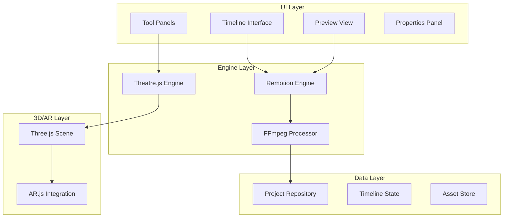
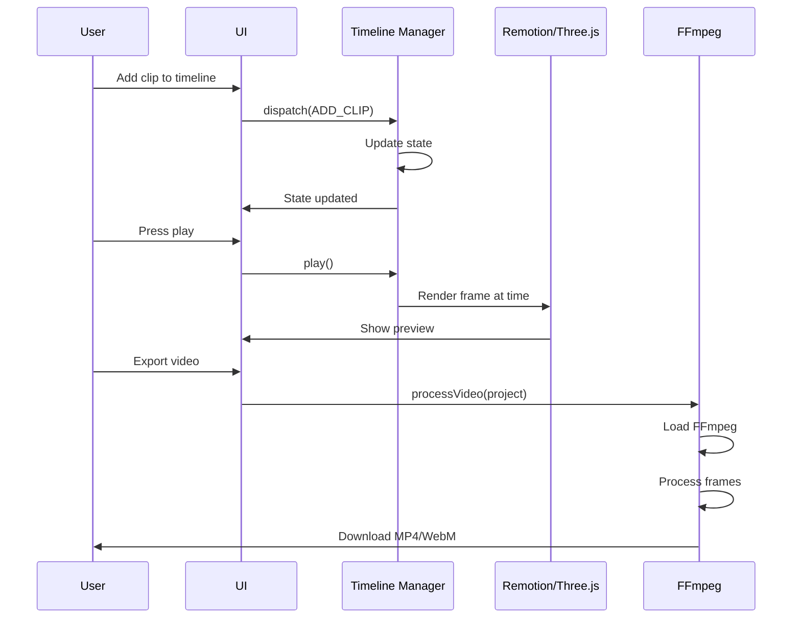

# Promo Cut Complete Architecture Plan

## Executive Summary

This plan outlines the comprehensive architecture for building **Promo Cut** as a professional video editing module for LiveDealz Studio. The system combines:

1. **Programmatic Video Rendering** (Remotion)
2. **AR/3D Scene Composition** (Theatre.js, Three.js)
3. **Video Processing** (FFmpeg.wasm)
4. **Professional UI** (Custom timeline with @twick reference)

---

## System Architecture Overview



---

## Technology Stack

### 1. Core Video Rendering: Remotion

**Status:** ✅ Installed and implemented

**Components:**
- `VideoComposition.tsx` - Main composition renderer
- `VideoPlayer.tsx` - Player with controls
- `Transitions.tsx` - Transition effects
- Filter system via CSS filters

**Integration:**
- Uses `<Sequence>`, `<Video>`, `<Audio>`, `` components
- Custom filter wrapper for CSS-based effects
- Transition system with fade, slide, wipe, zoom effects

---

### 2. AR/3D Scene Composition

**Libraries to Install:**
```bash
npm install three @theatre/core @theatre/studio
npm install @ar-js-org/ar.js
```

**Architecture:**

```typescript
// src/engines/promo-cut/ar-scene/ARSceneManager.ts
export class ARSceneManager {
    private scene: THREE.Scene;
    private camera: THREE.PerspectiveCamera;
    private renderer: THREE.WebGLRenderer;
    
    // AR support
    private markerDetector?: AR.MarkerDetector;
    
    // Scene elements
    private productModels: Map<string, THREE.Group> = new Map();
    private overlays: Map<string, THREE.Mesh> = new Map();
    
    // Methods
    async initialize(container: HTMLElement): Promise<void>;
    async loadProductModel(productId: string, modelUrl: string): Promise<THREE.Group>;
    setProductPosition(productId: string, position: Vector3): void;
    addOverlay(overlayId: string, config: OverlayConfig): void;
    renderToCanvas(canvas: HTMLCanvasElement): void;
}
```

**Theatre.js Integration:**
```typescript
// src/engines/promo-cut/animation/AnimationManager.ts
import { Core, studio } from '@theatre/core';

export class AnimationManager {
    private studio: typeof studio;
    private project: Project;
    
    // Pre-defined animations
    createProductEntrance(productId: string): Sequence;
    createPriceReveal(productId: string): Sequence;
    createCalloutPulse(overlayId: string): Sequence;
}
```

---

### 3. Video Processing (FFmpeg.wasm)

**Library to Install:**
```bash
npm install @ffmpeg/ffmpeg @ffmpeg/util
```

**Architecture:**
```typescript
// src/engines/promo-cut/processing/VideoProcessor.ts
import { FFmpeg } from '@ffmpeg/ffmpeg';
import { fetchFile, toBlobURL } from '@ffmpeg/util';

export class VideoProcessor {
    private ffmpeg: FFmpeg;
    private loaded: boolean = false;
    
    // Initialize FFmpeg (needs to load WASM)
    async initialize(): Promise<void>;
    
    // Operations
    async trimVideo(input: File, start: number, end: number): Promise<Blob>;
    async concatenateVideos(inputs: File[]): Promise<Blob>;
    async applyFilter(input: File, filter: string): Promise<Blob>;
    async exportWithWatermark(input: File, watermark: WatermarkConfig): Promise<Blob>;
    async convertFormat(input: File, outputFormat: 'mp4' | 'webm'): Promise<Blob>;
}
```

---

### 4. Timeline Management

**Architecture:**
```typescript
// src/engines/promo-cut/timeline/TimelineManager.ts
import { TimelineState, Track, Clip, Transition } from '@/types/promo-cut';

export class TimelineManager {
    private state: TimelineState;
    private undoStack: TimelineState[] = [];
    private redoStack: TimelineState[] = [];
    
    // Track operations
    addTrack(track: Track): void;
    removeTrack(trackId: string): void;
    reorderTracks(trackIds: string[]): void;
    
    // Clip operations
    addClip(trackId: string, clip: Clip): void;
    removeClip(clipId: string): void;
    moveClip(clipId: string, newTrackId: string, newStartTime: number): void;
    splitClip(clipId: string, splitTime: number): [Clip, Clip];
    trimClip(clipId: string, trimStart: number, trimEnd: number): void;
    
    // Transition operations
    addTransition(clipId: string, transition: Transition): void;
    removeTransition(clipId: string): void;
    
    // Playback
    play(): void;
    pause(): void;
    seek(time: number): void;
    
    // History
    undo(): void;
    redo(): void;
}
```

---

## Component Architecture

### UI Components Structure

```
src/app/promo-cut/
├── page.tsx                    # Main editor page
├── components/
│   ├── EditorLayout.tsx       # Main layout
│   ├── Timeline/
│   │   ├── Timeline.tsx        # Timeline container
│   │   ├── Track.tsx          # Single track
│   │   ├── Clip.tsx           # Clip component
│   │   ├── Ruler.tsx          # Time ruler
│   │   └── Playhead.tsx      # Playhead indicator
│   ├── Preview/
│   │   ├── PreviewPanel.tsx   # Video preview
│   │   ├── ARPreview.tsx      # AR preview mode
│   │   └── Canvas.tsx        # Rendering canvas
│   ├── Panels/
│   │   ├── MediaPanel.tsx     # Import media
│   │   ├── FiltersPanel.tsx  # Filter selection
│   │   ├── TransitionsPanel.tsx
│   │   ├── TextPanel.tsx     # Text tools
│   │   ├── ARPanel.tsx       # AR/3D tools
│   │   └── PropertiesPanel.tsx
│   └── Controls/
│       ├── Toolbar.tsx        # Top toolbar
│       └── Transport.tsx      # Play/pause controls
```

---

## Data Flow



---

## Phase Implementation Plan

### Phase 1: Core Video Editing ✅
- [x] Remotion installation
- [x] Basic composition
- [x] Filter system
- [x] Transition system
- [x] Timeline UI

### Phase 2: AR/3D Integration (Next)
- [ ] Install Three.js
- [ ] Install Theatre.js
- [ ] Create ARSceneManager
- [ ] Build AR preview component
- [ ] Add product model support

### Phase 3: Video Processing
- [ ] Install FFmpeg.wasm
- [ ] Implement VideoProcessor
- [ ] Add export functionality
- [ ] Add watermarking

### Phase 4: Professional Polish
- [ ] Advanced transitions
- [ ] Keyframe animations
- [ ] Audio mixing
- [ ] Color grading

---

## Key Interfaces

### VideoProject
```typescript
interface VideoProject {
    id: string;
    name: string;
    settings: ProjectSettings;
    tracks: Track[];
    duration: number;
    aspectRatio: '16:9' | '9:16' | '1:1';
    arScene?: ARSceneConfig;
}
```

### ARSceneConfig
```typescript
interface ARSceneConfig {
    enabled: boolean;
    markers?: string[];
    productModels: ProductModel[];
    overlays: Overlay3D[];
    lighting: LightingConfig;
}
```

---

## Recommendations

1. **Start with Remotion** - Already implemented, provides core functionality
2. **Add Three.js gradually** - Use for 3D product overlays
3. **Theatre.js for animations** - Professional motion design toolset
4. **FFmpeg for export** - Browser-based video processing

This architecture provides a scalable foundation for building a professional video editing experience in LiveDealz Studio.
